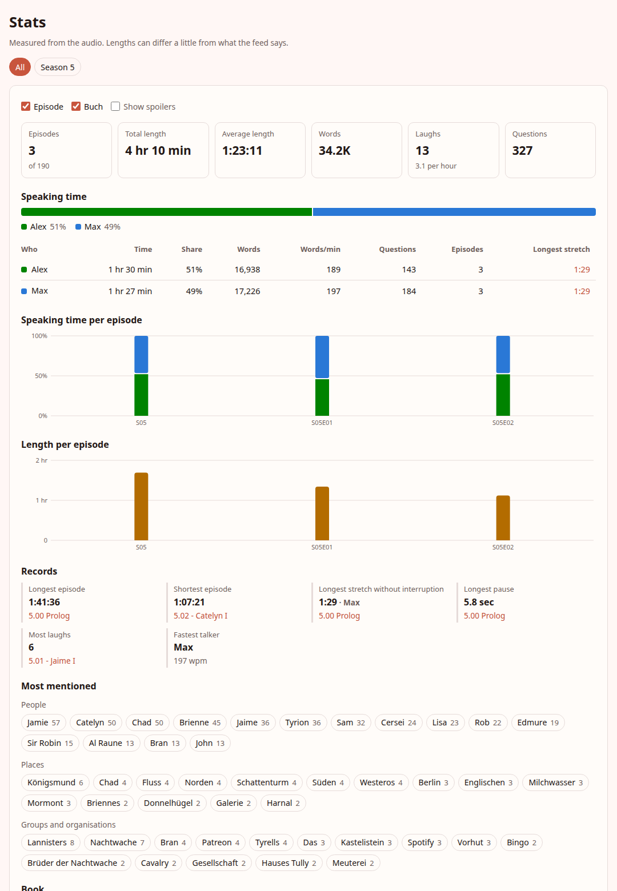
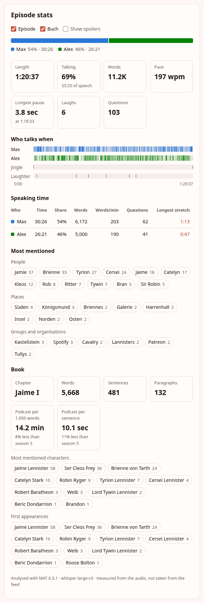
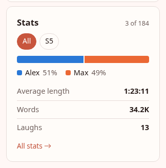
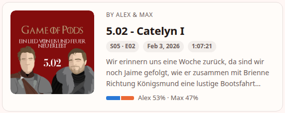
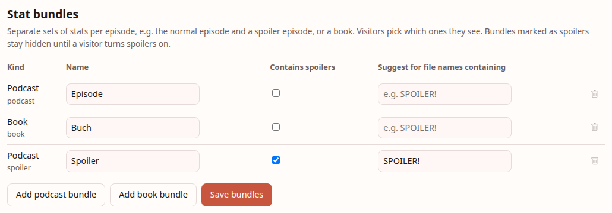
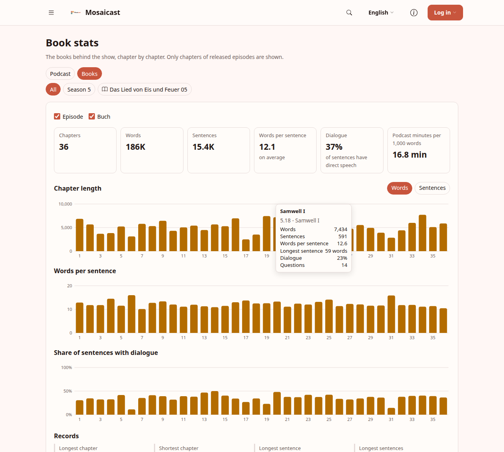
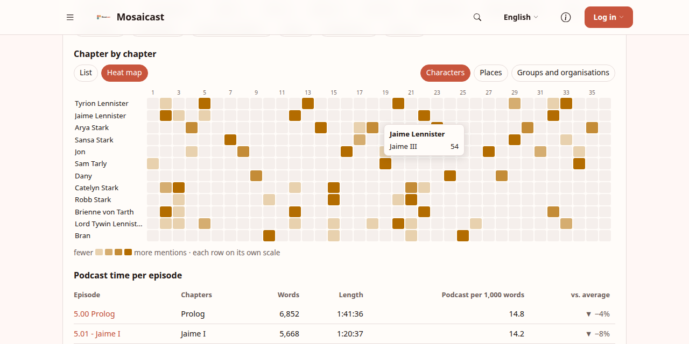
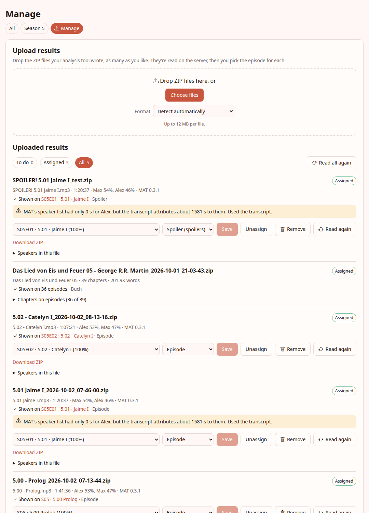

# mosaicast-plugin-stats

> Speaking time, episode length, pauses, laughs and the most mentioned names for your podcast, from your own
> audio analysis, and chapter stats for the books you talk about. MAT is the first supported source.

Part of **[Mosaicast](https://github.com/Mosaicast)**, an extensible website platform for podcasts. Status:
**0.1.2**, the first release line (see [CHANGELOG](CHANGELOG.md)). Needs core 0.8.0 or newer.



## What it does

You run an analysis tool over your episodes, upload its results on the site, and the plugin shows what's in
them:

- **On the episode page:** who talked how much, a timeline of who speaks when (click it to play from there),
  length, pace, longest pause, laughs, questions, and the people and places that came up most. For a book
  podcast also the chapters the episode covers: words, sentences, minutes of podcast per 1,000 words compared
  to the season, the most mentioned characters and who appears for the first time.
- **On feed cards:** a one-line split, e.g. "Alex 53 % · Max 47 %".
- **In the feed panel:** the same numbers summed over the feed. It follows the feed's season filter, or
  offers its own season switch when none is set.
- **At `/p/stats`:** the whole show or one season: totals, speaking time per person, a chart per episode,
  records (longest episode, most back-and-forth, fastest talker, …, each with its full ranking) and the most
  mentioned names.
- **At `/p/stats/manage`** (podcasters): upload results in bulk, check what was read, assign each result to
  an episode (the plugin suggests one from the file name, and spreads a book's chapters over the episodes by
  title), set up bundles, and set display names and colours per speaker.

<table>
  <tr>
    <td width="52%"></td>
    <td>
      <br><br>
      
    </td>
  </tr>
</table>

Numbers are measured from the audio, so they can differ a bit from the runtime in the feed. They only ever
show up inside the plugin's own tiles; the core display keeps using the feed (ARCHITECTURE §4.2).

## Bundles: normal, spoiler, book

An episode can have more than one set of stats, each in a **bundle**. Game of Pods for example has:

| Bundle | Kind | Spoilers | Gets results whose file name contains |
|---|---|---|---|
| Episode | podcast | no | (default) |
| Spoiler | podcast | yes | `SPOILER!` |
| Buch | book | no | (default) |

Visitors pick with checkboxes which bundles they see; several ticked podcast bundles add up (the time spent
talking across both recordings, shares recomputed). Bundles marked as spoilers are off and their box hidden
until the visitor ticks **Show spoilers**: the most mentioned names of a spoiler episode are spoilers too.
Without any settings there is one bundle per kind and nothing to pick.

Bundles are a site setting, set up on the manage page by admins. Podcasters see them there but can't change
them (a `writableBy: admin` key floor on `bundles`).



**Remembering the choice.** Signed-in visitors' choice goes into their own per-user document on the server
(nothing on the device). For anonymous visitors it's kept in `sessionStorage` for as long as the tab is open,
written only when they change something, with no identifier in it. The manifest declares it as a *necessary*
service, which core only treats as such after an admin approves it once (Admin → Consent); until then
visitors are asked. Keeping an anonymous choice across visits isn't done: that would need consent. This is
the "UI customisation" case EU guidance exempts from consent (Art. 29 WP Opinion 04/2012), but check it for
your site, it's not legal advice.

## Books

MAT also analyses EPUBs. A book result is read chapter by chapter, keeping **counts and names only**: words,
sentences and paragraphs per chapter, how long the sentences are, how many carry direct speech or end in a
question, the characters MAT found with how often each chapter mentions them, who appears for the first time,
and the places and groups the chapter names. No text of the book is stored, and MAT's AI chapter summaries
are ignored.

On upload, each chapter heading is matched against the episode titles ("Jaime I" → "5.01 - Jaime I"). Once
most chapters agree on a season, that season wins the ambiguous ones (every book has a "Prolog"). Episodes
that already show another book are skipped, so volume 6's "Arya I" doesn't land on volume 5's. The manage
page shows a chapter → episode table to correct or complete it. A podcast that covers a whole book in one
episode puts all chapters on that episode, and visitors get a chapter picker there.

`/p/stats/books` is the books' own overview, built like the podcast one: for the whole show, one season
(`books/season/5`) or one book (`books/<title>`, e.g. `books/das-lied-von-eis-und-feuer-05`). It has

- totals: chapters, words, sentences, words per sentence, share of dialogue, podcast minutes per 1,000 words;
- charts chapter by chapter: length (words or sentences), words per sentence, share of dialogue;
- records: longest and shortest chapter, longest sentence, wordiest chapter, most and least dialogue, each
  with its full ranking a click away;
- most mentioned characters, places and groups;
- chapter by chapter, as a list (top 3 or 5 characters, places, groups and first appearances per chapter) or
  as a heat map (the most mentioned names against the chapters, each row on its own scale);
- books and seasons side by side;
- podcast against book, episode by episode: minutes per 1,000 words of book (tinted blue to orange by how
  far below or above average it is), seconds per sentence, words spoken per word of book, laughs, and the
  1, 3 or 5 names the episode talked about most. Every number column sorts.

Only chapters of released episodes are in there, so the overview never runs ahead of the show. The podcast
pages show a short book summary with a link to it.




## Uploading results

1. Run [MAT](https://github.com/GameOfPods/MAT) (0.3 or newer) with `--output-zip` on your episodes.
2. Open **Manage stats** in the menu (or `/p/stats/manage`) and drop the ZIP files there, as many as you like.
3. A few seconds later each upload shows up with a suggested episode. Use **Assign N clear matches**, or pick
   the episode by hand. Under "Speakers in this file" you can say that e.g. `sprecher_1` is really Alex.
4. Set names and colours for your speakers once; they apply everywhere.

You can assign results to an episode that is still planned or only announced. The stats stay hidden until
the episode is released, then appear on their own. If an episode is withdrawn or its plan cancelled, its
stats come down again.

Re-uploading a result for the same audio file (same hash) replaces the old one and keeps its episode.
Uploaded archives are kept (visible to podcasters only), so **Read again** / **Read all again** rebuilds the
stats with the current reader after a plugin update, without uploading anything.



### From a script

Uploading is a single request; the backend finds new files on its own. With a personal access token
(Account → Tokens, from a podcaster account):

```bash
curl -H "Authorization: Bearer $MOSAICAST_TOKEN" -F "file=@5.01 Jaime I.zip" \
  https://your.site/api/plugins/stats/blob

# a whole season
for f in results/*.zip; do
  curl -fsS --retry 5 -H "Authorization: Bearer $MOSAICAST_TOKEN" -F "file=@$f" \
    https://your.site/api/plugins/stats/blob
done
```

Core allows 10 uploads per minute per client by default (`mosaicast.rate-limit.upload-limit`). More than that
gets `429` with a `Retry-After`; `--retry` makes curl wait and try again. The manage page does the same on its
own and shows "Upload limit reached" while it waits.

The results then wait on the manage page for you to assign them.

Things the reader had to work around show up as warnings on the import. Files it can't use (an old MAT
format, a damaged archive, something that isn't an analysis) show why.

## How it works

Plugins have no HTTP routes of their own, so an upload goes to core's generic file storage and the backend
notices it on its next tick. Everything else the manage page does (assign, read again, remove) goes through
a small command queue in the doc store:

```
browser or curl ── upload ZIP ──► plugin file storage (podcasters only)
                                          │  every 10 s (configurable)
backend ◄─────────────────────────────────┘
  ├─ any ZIP no import knows yet is new: read it
  ├─ unzip in memory under limits, refuse zip slip / zip bombs
  ├─ pick a reader (auto-detect, or one picked by hand on the manage page)
  ├─ normalise to EpisodeStats (podcast) or BookStats (book), suggest a bundle (file-name rules)
  │  and an episode (title, season/episode number), or for a book one episode per chapter
  ├─ write import:<id> (+ staged:<id>), keep the ZIP for re-reads
  └─ on assign (a cmd:<id> from the manage page): write episode/<slug>/stats:<bundle> and the site index
```

- **Readers.** `StatsReader` (`id`, `name`, `canRead`, `read`) turns one tool's output into source-agnostic
  units: `EpisodeStats` (kind `podcast`) or `BookStats` (kind `book`). `MatStatsReader` is the first and
  reads both; adding a source means adding a class to `ReaderRegistry`, nothing else changes. A unit may
  describe an episode, a season or a feed.
  Mapping details for MAT: [`docs/MAT-FORMAT.md`](docs/MAT-FORMAT.md).
- **Storage.** All in the generic doc store. Everything the backend computes is `backendOwned`, so nobody
  can overwrite published stats through the data API. Clients write `cmd:*` (the queue), `bundles` and
  `speakers` (settings), and signed-in visitors their own `view` choice in the per-user scope.
- **Assignments.** An import can be shown in several places: a podcast result on one episode in one bundle,
  a book on many episodes, each with the chapters it covers. One import per episode and bundle; assigning
  another one replaces it.
- **Same file name, different content** is fine: each upload gets its own id from core. Two results for the
  same audio (same hash in MAT's `meta.json`) are one import; the newer replaces the older and keeps its
  episode.
- **Aggregation** happens in the browser from one `index` document (episode → bundle → summary): whatever
  episodes the host hands a tile (a feed, a season, the whole site) and whatever bundles the visitor ticked
  get summed on the spot. That keeps every combination correct without stored per-season documents that
  would go stale.
- **Archives are private.** The stats are public (`data.readableBy: anonymous`), but the ZIPs behind them
  hold full transcripts and local file paths, so `blobs.readableBy` is `podcaster`. Removing an import
  removes its archive.
- **Release phases**: stats are published only for released episodes. Core tells the plugin when a planned
  episode is released (`onEpisodeReleased`) and when one goes quiet again, is withdrawn or cancelled
  (`onEpisodePhaseChanged`, platformApi 0.19), and stats go up or down right then. The schedule double-checks
  waiting stats every tick and live ones every 5 minutes, since those events aren't replayed.
- **Bookkeeping is for podcasters.** Import records, staged results and the command queue can name an episode
  that is still a quiet plan, so they sit behind a `podcaster` key floor (`data.keyFloors`, platformApi
  0.19). That's also why quiet plans can be suggested as matches: you can analyse an episode before you
  announce it.
- **Seasons** come from the episode snapshot (`DisplaySnapshot.season`, platformApi 0.17), with the host's
  episode label as a fallback.

## Notes

- **Personal data:** the only thing stats keeps about a person is their bundle/spoiler choice, a USER-scope
  document that core exports and erases itself. The plugin's `UserDataHandler` says so, so a data export
  lists stats as "nothing held" rather than "not supported".

Deviations from `docs/BRIEF.md`, on purpose: aggregates are computed in the browser instead of cached as
`agg` documents (see above), the MAT input is format 2 (`result.json`) instead of the format 1 files the
brief describes, and stats live under `stats:<bundle>` (bundles and books came after the brief).

## Build & test

```bash
./build.sh                                     # -> dist/ (stats.jar, assets/stats.es.js, plugin.json)
cd backend && ./gradlew test                   # readers, archive limits, the whole ingest/assign flow
cd frontend && npm test && npm run typecheck   # aggregation, components, manifest contract
```

The backend needs the SDK from GitHub Packages (`gpr.user` / `gpr.token` in `~/.gradle/gradle.properties`, a
PAT with `read:packages`) or an SDK checkout published with `./gradlew publishToMavenLocal`.

`./gradlew test -PstatsSamples=/path/to/results` also runs every ZIP in that folder through the readers and
prints the numbers, which is handy for checking real results without putting them in the repo.

## Install

`./build.sh`, then copy `dist/` to `$MOSAICAST_PLUGINS_DIR/stats/` (or run `./install.sh`) and restart core.
A tagged release attaches `plugin.tgz`, installable as `MOSAICAST_PLUGINS=Mosaicast/mosaicast-plugin-stats@vX.Y.Z#sha256:…`.

Needs **core 0.8.0** or newer (platformApi 0.19): key floors, the phase-change event, quiet plans in
`ctx.episodes` for podcasters, and uploads judged by their bytes when curl sends `application/octet-stream`.

**Config** (admin): `queueIntervalSeconds`, how often the backend works the upload queue (10–600 s,
default 10).

### Testing on a dev instance

With a `mosaicast-core` checkout next to this repo:

```bash
./build.sh
cd ../mosaicast-core
dev/instance.sh --name stats up --plugin-dir "$OLDPWD/dist"
dev/instance.sh --name stats restart --plugin-dir "$OLDPWD/dist"   # after a rebuild; keeps the data
```

Then add a real feed under Admin → Feeds, log in as a podcaster and upload on `/p/stats/manage`.

## Contributing

Contributions welcome, see [`CONTRIBUTING.md`](CONTRIBUTING.md). In short: `git commit -s` (DCO, required),
SPDX header in new files, add tests. A new language is a copy of `frontend/locales/en.json`.

## License

**GNU Affero General Public License v3.0 or later**, see [`LICENSE`](LICENSE). Header per source file:
```
// SPDX-License-Identifier: AGPL-3.0-or-later
// SPDX-FileCopyrightText: 2026 The Mosaicast Authors
```
The MAT example result under `backend/src/test/resources/mat-example/` is MAT's own, Apache-2.0.

## Name & trademark

"Mosaicast" and the logo denote the official project. Please rename forks.
